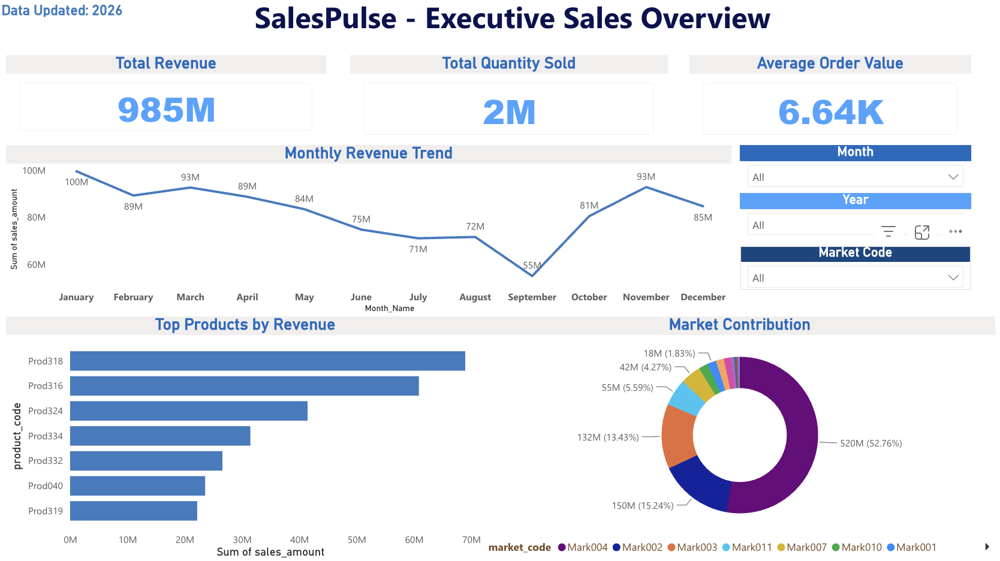

# SalesPulse Dashboard 📊

## Overview

SalesPulse is an end-to-end Sales Analytics and Business Intelligence project built using Python, SQL, and Power BI.

The project focuses on transforming raw sales data into actionable business insights through:

* Data Cleaning
* Exploratory Data Analysis (EDA)
* Feature Engineering
* KPI Analysis
* Interactive Dashboard Development

The dashboard enables users to monitor sales performance, analyze customer behavior, identify product trends, and track important business KPIs in an interactive and visually intuitive manner.

---

# 🚀 Tech Stack

| Technology       | Purpose                    |
| ---------------- | -------------------------- |
| Python           | Data Analysis & Processing |
| Pandas           | Data Manipulation          |
| NumPy            | Numerical Operations       |
| Matplotlib       | Data Visualization         |
| Seaborn          | Statistical Visualization  |
| SQL              | Querying & KPI Extraction  |
| Power BI         | Dashboard & Reporting      |
| Jupyter Notebook | Development Environment    |

---

# 📂 Project Structure

```text
SalesPulse_Project/
│
├── data/
│   ├── cleaned/
│   │   └── final_sales_features.csv
│   │
│   └── raw/
│       └── db_dump.sql
│
├── notebooks/
│   ├── 01_eda.ipynb
│   └── 02_feature_engineering.ipynb
│
├── sql/
│   └── kpi_queries.sql
│
├── visuals/
│
├── reports/
│
├── powerbi/
│
├── dashboard/
│   └── dashboard_preview.png
│
├── README.md
├── requirements.txt
└── .gitignore
```

---

# 📈 Key Features

* Revenue Analysis
* Monthly Sales Trend Analysis
* KPI Tracking Dashboard
* Average Order Value (AOV) Analysis
* Customer Purchase Insights
* Product Performance Evaluation
* Category-wise Sales Analysis
* Interactive Visual Reporting

---

# 📊 Dashboard Insights

The Power BI dashboard provides interactive business insights including:

* Total Revenue
* Total Orders
* Average Order Value (AOV)
* Monthly Revenue Trends
* Product Category Performance
* Sales Distribution Analysis
* Customer Behavior Insights

---

# ⚙️ Installation & Setup

## Clone the Repository

```bash
git clone <repository-link>
```

## Navigate to Project Directory

```bash
cd SalesPulse_Project
```

## Install Required Libraries

```bash
pip install -r requirements.txt
```

## Launch Jupyter Notebook

```bash
jupyter notebook
```

---

# 📌 Future Enhancements

* Sales Forecasting using Machine Learning
* Customer Segmentation
* Real-Time Dashboard Integration
* Streamlit Web Application Deployment
* Automated Reporting Pipeline

---

# 📷 Dashboard Preview



---

# 🧠 Learning Outcomes

This project demonstrates practical understanding of:

* Data Cleaning & Preprocessing
* Exploratory Data Analysis
* Business KPI Design
* Dashboard Development
* Data Visualization Best Practices
* Analytical Problem Solving

---

# 👤 Author

### Simran

Aspiring Data Analyst passionate about Business Intelligence, Data Visualization, and Analytics-driven decision making.

---
